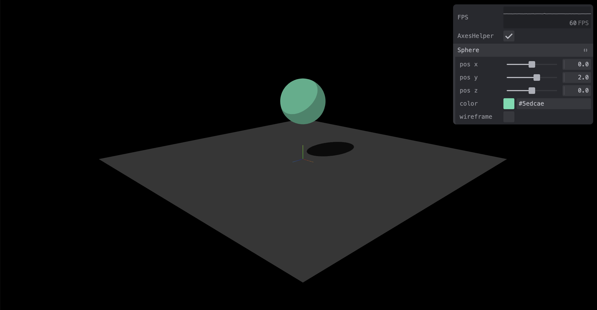

<h1 align="center"> Scene WebGL com Three.js</h1>

<p align="center">
Este projeto foi construído para fundamentar conceitos da disciplina de Computação Gráfica de forma prática.
</p>

<p align="center">
  <a href="#-tecnologias">Tecnologias</a>&nbsp;&nbsp;&nbsp;|&nbsp;&nbsp;&nbsp;
  <a href="#-projeto">Projeto</a>&nbsp;&nbsp;&nbsp;|&nbsp;&nbsp;&nbsp;
  <a href="#memo-licença">Licença</a>
</p>

<p align="center">
  
</p>

<br>

<p align="center">
  
</p>

Live demo: [https://scene.danilob.com.br](https://scene.danilob.com.br/)

## 🚀 Tecnologias

Esse projeto foi desenvolvido com as seguintes tecnologias:

- HTML e CSS
- [Node e NPM](https://nodejs.org/)
- [Typescript](https://www.typescriptlang.org/)
- [Vite](https://vitejs.dev/)
- [Threejs](https://threejs.org/)
- [Tweakpane](https://cocopon.github.io/tweakpane/)

## 💻 Projeto

Neste projeto foi construído um cenário utilizando o pacote **Three.js** em conjunto com o **Vite** para exibir a manipulação de um ambiente de computação gráfica.

Para construção desse projeto base foi utilizado o [vídeo](https://www.youtube.com/watch?v=TiWRM3J5FlI) do canal Alvaro Dev Labs. Com algumas alterações, visto que o projeto do vídeo é um pouco mais antigo.

Para executar o projeto é necessário ter o `node` e `npm` instalados. Feito isso basta executar os seguintes comandos:

```
npm install
npm run dev
```

Será exibido o endereço para que consiga acessar a aplicação em `http://localhost:5173/`

## :memo: Licença

Esse projeto está sob a licença MIT.

---

Feito com ♥ by Danilo Borges da Silva
